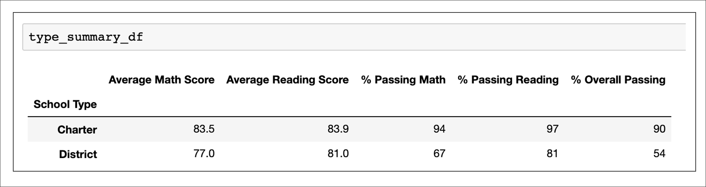

# School_District_Analysis

The school board has notified Maria and her supervisor that the students_complete.csv file shows evidence of academic dishonesty; specifically, reading and math grades for Thomas High School ninth graders appear to have been altered. Although the school board does not know the full extent of the academic dishonesty, they want to uphold state-testing standards and have turned to Maria for help. She has asked you to replace the math and reading scores for Thomas High School with NaNs while keeping the rest of the data intact. Once you’ve replaced the math and reading scores, Maria would like you to repeat the school district analysis that you did in this module and write up a report to describe how these changes affected the overall analysis.

## Overview
School data will be analyzed against student test scores to identify any correlation in student outcomes with school types, size, and budget per student. The data analyzed consist of approximately 39,000 student test results from 15 schools. Allegations have been made that 9th grade testing scores from Thomas High SChool have been compromised. As such, a seperate set of analysis will be performed with Thomas High School ninth grade data removed.

## Initial Results

