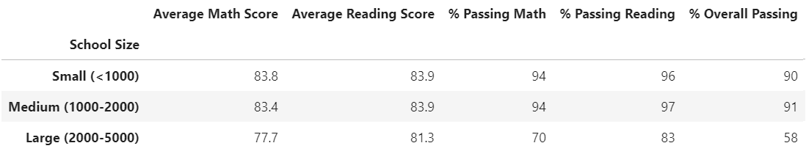

# School_District_Analysis

## Overview
School data will be analyzed against student test scores to identify any correlation in student outcomes with school types, size, and budget per student. The data analyzed consist of approximately 39,000 student test results from 15 schools.

## Results
Allegations have been made that 9th grade testing scores from Thomas High SChool have been compromised. As such, a seperate set of analysis will be performed with Thomas High School ninth grade data removed. The unfiltered dataset are part of the "Iniital" results, and the filtered data is reported as the "Adjusted" results.

|Analysis| Dataset | Results |
| --- | --- |---|
|Spending|Initial||
||Adjusted||
|Student Size|Initial||
||Adjusted||
|School Type|Initial||
||Adjusted||

